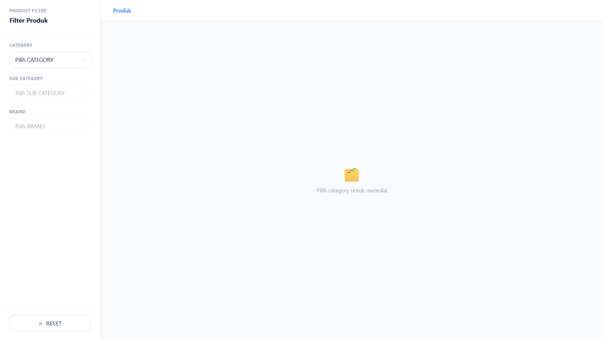
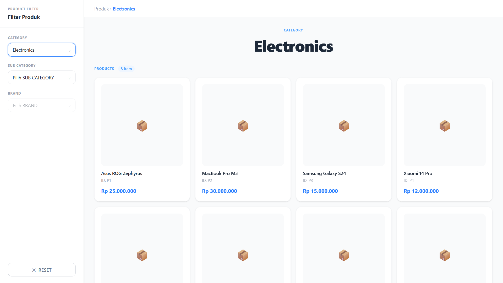
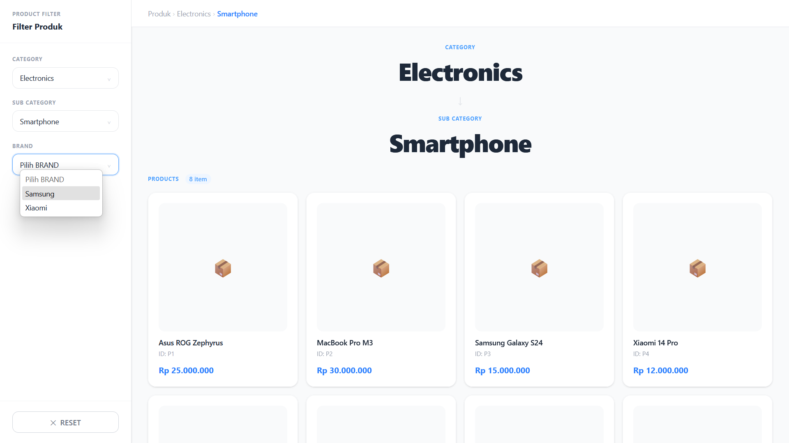

# 🛍️ Product Filter App

A simple React application that implements **cascading dropdown filters** (Category → Sub Category → Brand) and dynamically displays a list of products based on the selected filters.

Built using **React + TypeScript + Vite + Tailwind CSS**.

---

## 🚀 Features

* ✅ Cascading dropdown:

  * Category → Sub Category → Brand
* ✅ Dynamic filtering using query params
* ✅ Product list updates automatically based on selection
* ✅ Breadcrumb navigation to show current selection
* ✅ Reset filter functionality
* ✅ Clean and responsive UI

---

## 🧱 Tech Stack

* React 19
* TypeScript
* Vite
* React Router DOM
* Tailwind CSS

---

## 📂 Project Structure

```
src/
├── components/
│   ├── breadcrumb.tsx
│   ├── category-display.tsx
│   └── category-select.tsx
├── loader/
│   └── category-loader.tsx
├── page/
│   └── filter-page.tsx
├── types/
│   └── categories.ts
├── utils/
│   └── category-filter.ts
```

---

## ⚙️ Installation & Setup

```bash
# install dependencies
npm install

# run development server
npm run dev

# build project
npm run build

# preview production build
npm run preview
```

---

## 🧠 How It Works

1. Data is loaded from:

   ```
   public/data/category.json
   ```

2. The app uses **URL search params** to store state:

   * `?category=C1`
   * `?subCategory=S1`
   * `?brand=B1`

3. Filtering logic:

   * Sub Categories filtered by `categoryId`
   * Brands filtered by `subCategoryId`
   * Products filtered by `brandId`

4. UI updates automatically based on selected values.

---

## 🎯 Key Components

* **Select Component**

  * Reusable dropdown component
* **Breadcrumb**

  * Displays current selection path
* **Category Display**

  * Shows selected hierarchy + product list
* **Filter Page**

  * Main logic and state handling

---

## 📸 Visual Documentation

### 1. Initial State (No Selection)



---

### 2. Category Selected



---

### 3. Cascading Dropdown in Action




---

## 👨‍💻 Author

**Rifky Kurniawan**

---

## 📄 License

This project is for assessment / code challenge purposes.
